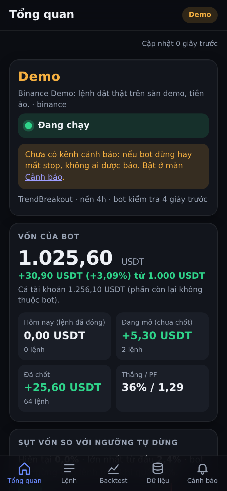
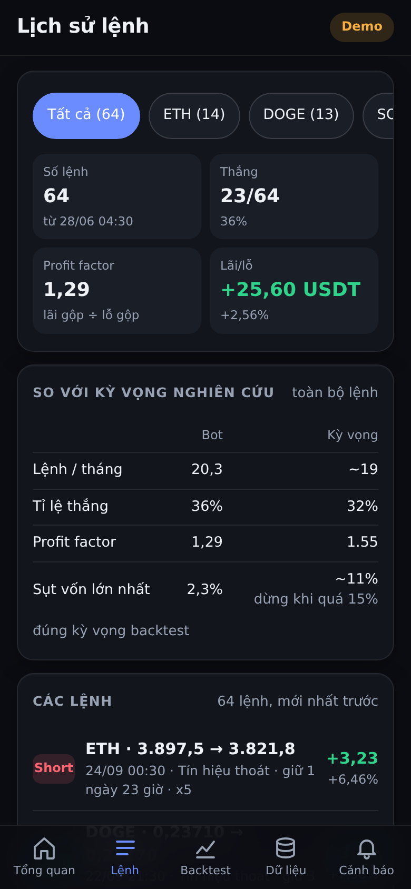
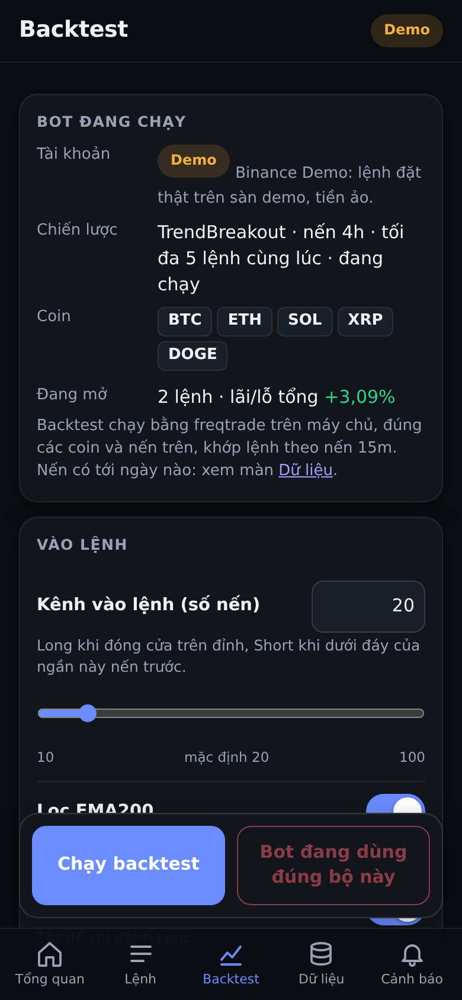
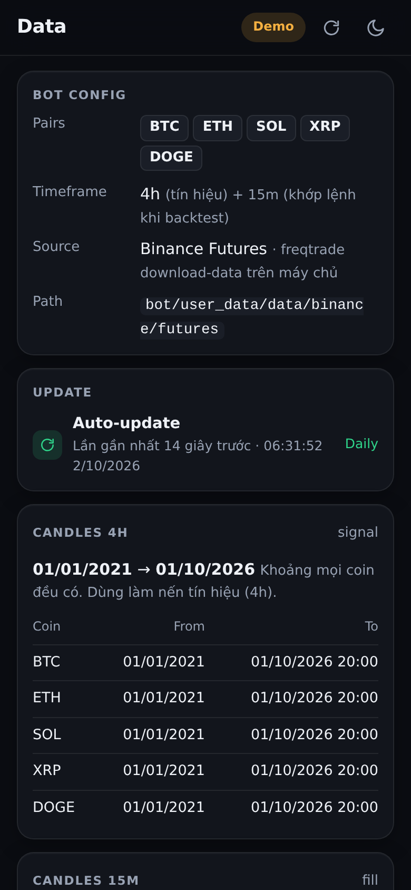
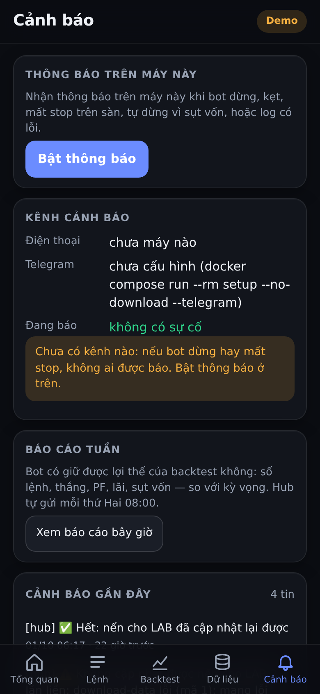

# Bot giao dịch TrendBreakout — bot freqtrade + bảng điều khiển trên điện thoại

Repo gồm hai phần:

| Phần | Ở đâu | Việc |
|---|---|---|
| **Bot** | `bot/` | freqtrade 2026.8 chạy chiến lược TrendBreakout (nến 4h, 5 coin BTC ETH SOL XRP DOGE, tối đa 5 lệnh, SL 3×ATR, rủi ro 1% vốn/lệnh, tự dừng vào lệnh mới khi sụt vốn > 25%) trên Binance, tiền thật. Cách cài: [`bot/deploy/README.md`](bot/deploy/README.md). Nghiên cứu: `bot/research/`. |
| **Hub + app** | `bot/hub/` (server) và thư mục gốc (`index.html`, `js/`, `css/`, `icons/`) | Một server FastAPI trên máy nhà (cổng 8090, mở qua Tailscale) phục vụ **app điều khiển bot** cho iPhone (cài lên màn hình chính như PWA) và PC. Mọi số liệu đi qua hub; mật khẩu bot và API key không bao giờ tới trình duyệt. |

## App: bot đang làm gì, tiền thế nào, có gì cần làm

Nhãn, tiêu đề, nút dùng tiếng Anh ngắn gọn; giải thích, thông báo, cảnh báo và log bằng tiếng Việt. 5 màn hình, thanh tab dưới cùng; thanh tiêu đề có nút tải lại và sáng/tối:

| Màn | Trả lời câu hỏi | Nguồn |
|---|---|---|
| **Overview** | Chế độ (Dry-run / Demo / **LIVE**, màu khác nhau), bot đang chạy hay đã dừng / tự dừng vì sụt vốn / không xử lý nến; vốn, lãi lỗ hôm nay + tổng, sụt vốn so với ngưỡng tự dừng 25%; lệnh đang mở (coin, chiều, lãi lỗ, giá stop, stop có trên sàn không); đường vốn; lãi lỗ theo ngày; cảnh báo trong log bot | `/api/live` (15 s/lần khi app đang hiện) |
| **Trades** | Mọi lệnh đã đóng, lọc theo coin; số lệnh, thắng, profit factor; so với kỳ vọng nghiên cứu (~19 lệnh/tháng, thắng 32%, PF 1,55) | `/api/trades` |
| **Backtest** | Chỉnh tham số chiến lược (nhãn ngắn + giải thích tiếng Việt, giới hạn từ chính class chiến lược), chọn khoảng thời gian và vốn thử, chạy backtest **bằng freqtrade ở LAB** (khớp lệnh theo nến 15m), kết quả tóm tắt + theo năm + theo coin + đường vốn + **danh sách từng lệnh** (lọc theo coin), lịch sử các lần thử, **Apply to bot** với hộp xác nhận ghi rõ giá trị cũ → mới và tài khoản nào | `/api/tune/*` |
| **Data** | Nến LAB có coin nào, khung nào, từ ngày nào tới ngày nào, hub tự cập nhật lúc nào, đang tải không, lỗi gì | `/api/tune/live` |
| **Alerts** | Kênh đang có (điện thoại, Telegram), sự cố đang báo, cảnh báo gần đây, báo cáo tuần; cuối trang: phiên bản, tải lại app | `/api/alerts`, `/api/weekly` |

Không có backtest chạy trong trình duyệt: số duy nhất đáng tin là freqtrade ở LAB (app cũ có bộ máy JS riêng, lệch freqtrade ở SOL/DOGE vì bảng bước khối lượng — đã bỏ).

<p>





</p>

Ảnh thêm (PC, các trạng thái tự dừng / tiền thật / mất bot / chưa có lệnh): [`docs/screenshots/`](docs/screenshots/).

### Dùng trên iPhone
Mở `https://<tên-máy>.<tailnet>.ts.net` trong Safari (bật Tailscale) → Chia sẻ → **Thêm vào MH chính** → mở từ biểu tượng đó.
Bật/tắt thông báo đẩy trên máy này: nút chuông ở thanh tiêu đề (bật xong có một thông báo thử). Thông báo đẩy chỉ nhận được khi mở app từ màn hình chính. Vỏ app được lưu sẵn (mở nhanh, mở được khi mất mạng — có báo "số liệu cũ"); dữ liệu luôn lấy mới từ hub.

## Cấu trúc

```
index.html, css/app.css      vỏ app (mobile-first, tối/sáng theo máy hoặc chọn tay)
js/app.js                    chuyển màn theo #hash, thanh tab, lấy /api/live chung, báo mất mạng, service worker
js/api.js                    MỘT chỗ gọi API hub: không cache, thời gian chờ, lỗi → câu tiếng Việt + việc cần làm
js/format.js                 MỘT chỗ định dạng số/tiền/%/ngày (kiểu Việt 1.234,56; lãi lỗ luôn có dấu +/-)
js/model.js                  ánh xạ dữ liệu API → thứ hiển thị (hàm thuần, có test)
js/ui.js, js/chart.js        mảnh giao diện dùng chung; biểu đồ SVG tự vẽ (không thư viện)
js/views/*.js                mỗi màn hình một module: overview, trades, backtest, data, alerts
js/version.js, sw.js         phiên bản app; service worker (cache vỏ app theo phiên bản, không cache /api)
manifest.webmanifest, icons/ PWA
tests/*.test.mjs             test logic (node --test) + node --check mọi file JS
tests/screenshots.mjs, .sh   chụp ảnh màn hình bằng Chromium headless (cần hub giả bên dưới)
bot/hub/                     server hub (server.py) + live.py, tune.py, labdata.py, weekly.py, alerts.py, push.py, candles.py
bot/hub/dev.py               hub GIẢ: chạy app với bot bịa để xem/thử không cần freqtrade
bot/deploy/, bot/user_data/  bot: compose, config, chiến lược, secrets (gitignore)
bot/research/                nghiên cứu (fastsim, robustness, ml_gate, ...) + workflow CI tương ứng
```

## Chạy thử app không cần bot

```bash
uv run --no-project --with fastapi --with uvicorn --with httpx --with cryptography python bot/hub/dev.py --scenario demo
# mở http://127.0.0.1:8090 — đăng nhập admin / dev. --scenario: demo | live | paper | halted | offline | empty
```

## Kiểm thử

```bash
npm test                                                   # logic JS + cú pháp mọi file JS (Node 22+)
uv run --no-project --with fastapi --with uvicorn --with httpx --with pytest --with cryptography \
  python -m pytest bot/hub/test_hub.py                     # hub (không cần freqtrade)
npm i -g playwright && bash tests/screenshots.sh           # chụp ảnh mọi màn hình vào docs/screenshots
```

CI (`.github/workflows/test.yml`) chạy hai lệnh đầu. Các workflow khác (`trend`, `robustness*`, `research`, `ml-gate`) thuộc phần nghiên cứu bot.

## Phát hành lên hub (máy chủ nhà)

Hub phục vụ app thẳng từ thư mục repo (bind mount chỉ đọc), nên:

```bash
cd btc-backtest-app && git pull
cd bot/deploy && docker compose restart hub     # mã hub (bot/hub/*.py) có đổi thì cần; chỉ đổi app thì không cần
```

Mỗi lần phát hành đổi `APP_VERSION` trong `js/version.js` **và** `CACHE` trong `sw.js` (test `tests/syntax.test.mjs` bắt hai giá trị này phải khớp) để điện thoại nhận bản mới; người dùng đóng app rồi mở lại.

## Tiến độ dự án (cập nhật 10/2026)

- **Bot**: TrendBreakout 4h 5 coin chạy Binance Demo; lộ trình Demo → tiền thật 500 USDT, chỉ đổi key (`setup --api`). Checklist trước tiền thật: `bot/deploy/README.md` bước 6.
- **App**: bản này thay app backtest cũ (bộ máy backtest JS, Vercel) và trang `/tune/` bằng một app điều khiển bot trên hub. Repo không còn chạy độc lập trên Vercel.
- **Nghiên cứu**: `bot/research/robustness_trend_2026-10.md` (độ bền TrendBreakout), `robustness_2026-10.md` (DonchianRevert, đã ngưng), `ml_gate_2026-10.md` (ML lọc lệnh không giúp).

### Lưu ý an toàn
- Stop nằm trên sàn (`stoploss_on_exchange`): bot hay máy tắt giữa chừng thì lệnh vẫn có stop. Hub canh mỗi phút và báo khi lệnh mở mà không có stop.
- Không dán API key vào chat hay commit. Key chỉ nhập qua `docker compose run --rm setup --api` (lưu ở `bot/deploy/secrets/`, đã gitignore). Key thật: chỉ bật Futures, **tắt rút tiền**, giới hạn IP.
- App chỉ đổi **tham số** chiến lược (trong giới hạn class chiến lược cho phép), không đổi logic, không vào/thoát lệnh.
- Kết quả quá khứ không bảo đảm tương lai. Không phải lời khuyên đầu tư.
